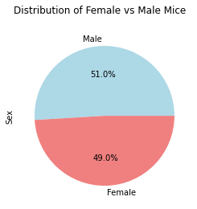

# pharm_plots

This is a summary of data from a recent animal study, where 249 mice identified with SCC tumor growth were treated with a variety of drug regimens. Researchers recorded the tumor volume over the course of 45 days. The purpose of this study was to study the effectiveness of the drug, Capomulin, to other drug regimens.

## Imported Python Libraries
* matplotlib.pyplot
* pandas
* scipy.stats
* numpy
* reduce

## Datasets and Fields
1. [Mouse metadata](data/Mouse_metadata.csv)
    - Mouse ID
    - Drug Regimen
    - Sex
    - Age_months
    - Weight (g)
2. [Study results](data/Study_results.csv)
    - Mouse ID
    - Timepoint
    - Tumor Volume (mm3)
    - Metastatic Sites

## Data Cleaning
Mice with duplicate duplicate tumor measures for a single timepoint are excluded from the joined dataset. A DataFrame of duplicates is generated by concatenating groups of mouse ID and timepoint value combinations that are more than one. Any mouse IDs with duplicated timepoints are filtered out for a clean dataset.

Mouse ID g989 is the only subject with duplicated timepoints in this case:
### Table of Duplicates

## Analysis
### Summary Statistics
Generate a summary statistics table of mean, median, variance, standard deviation, and standard error of the tumor volume for each drug regimen. Two alternate methods are demonstrated to create the same table:

1. Groupby and summary stats are generated in a DataFrame for each summary stat individually. Then, a lambda function was iterated over the list of DataFrames, using reduce() to merge the DataFrames into one table.
2. Groupby is used with the .agg() function to generate the summary results in a DataFrame in one line.
### Bar and Pie Charts
Generate a bar plot showing the total number of timepoints for all mice tested for each drug regimen. Then, use a pie plot to show the distribution of female vs male mice. Two alternate methods are demonstrated to generate the same charts:
#### Bar Charts:
- Pandas

- Pyplot

#### Pie Charts:
- Pandas

- Pyplot

### Quartiles, Outliers, and Boxplots
Calculate the final tumor volume of each mouse across four of the most promising treatment regimens: Capomulin, Ramicane, Infubinol, and Ceftamin. Then, calculate the quartiles and IQR and determine if there are any potential outliers across all four treatment regimens.

Only data for Infubinol yields an outlier:

Results of the boxplot showing the quartiles, range, and outliers of tumor volumes for selected drug regimens:

### Line and Scatter Plots
To select a mouse that was treated with Capomulin and generate a line plot of tumor volume vs time point and a scatter plot of tumor volume versus mouse weight for the Capomulin treatment regimen, first a filter is applied to create a DataFrame containing only Capomulin data.

A list of unique mice in the Capomulin treament is iterated through to create a bonus line chart visualizing data for each mice: tumor volume vs time point of observation:

A line chart was also created to visualize the tumor volume vs timepoint for a single mouse in Capomulin treatment:

Finally, the average tumor volume vs mouse weights of mice in the Capomulin treatment is saved in a DataFrame with values to be plotted as a scatterplot.
The correlation efficient between mouse weight and the average tumor volume is 0.84. A linear regression model is overlaid on the scatterplot to show the relationship between weight and tumor volume:

